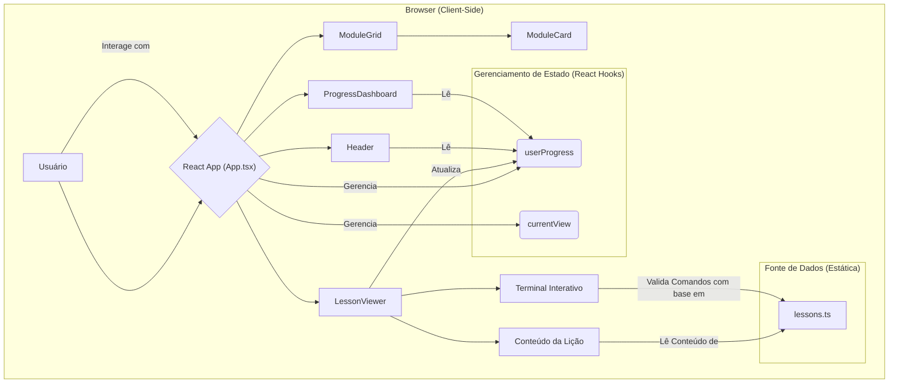

# Git Learning Hub: Desmistificando o Controle de Versão, um Commit de Cada Vez

**Plataforma interativa para aprender Git de forma prática, gamificada e acessível via navegador.**

<p align="center">
  <a href="https://git-learning-hub.vercel.app" target="_blank" rel="noopener noreferrer">
    
  </a>
</p>

---

## Abstract (Resumo Técnico)

O Git Learning Hub é uma aplicação web interativa, concebida como uma plataforma pedagógica para o ensino do sistema de controle de versão Git. O projeto aborda o desafio fundamental da curva de aprendizado associada ao Git, que, apesar de sua onipresença no desenvolvimento de software moderno, frequentemente representa uma barreira para iniciantes. A solução proposta materializa-se como uma Single-Page Application (SPA) que gamifica a experiência de aprendizagem, substituindo tutoriais passivos por um ambiente de prática imersivo e com feedback instantâneo. A metodologia central baseia-se em uma arquitetura reativa (React com TypeScript) que orquestra uma série de componentes, incluindo um terminal simulado, quizzes interativos e um painel de progresso. Este sistema permite que os usuários executem comandos Git em um ambiente seguro e controlado, resolvendo exercícios práticos que reforçam o conhecimento teórico. A contribuição principal do projeto reside na sua abordagem pedagógica, que efetivamente preenche a lacuna entre a compreensão teórica dos conceitos de Git e a sua aplicação prática, tudo dentro de uma plataforma autocontida e acessível diretamente pelo navegador, eliminando a necessidade de complexas configurações de ambiente local.

## Badges Abrangentes

[](./LICENSE)
[](https://github.com/ESousa97/git-learning-hub/issues)
[](https://github.com/ESousa97/git-learning-hub/pulls)
[](https://github.com/ESousa97/git-learning-hub/commits/main)
[](https://github.com/ESousa97/git-learning-hub)
[](https://github.com/ESousa97/git-learning-hub)

## Sumário

* [Introdução e Motivação](#introdução-e-motivação)
* [🔗 Acesso à Plataforma](#-acesso-à-plataforma)
* [Arquitetura do Sistema](#arquitetura-do-sistema)
* [Decisões de Design Chave](#decisões-de-design-chave)
* [✨ Funcionalidades Detalhadas (com Casos de Uso)](#-funcionalidades-detalhadas-com-casos-de-uso)
* [🛠️ Tech Stack Detalhado](#️-tech-stack-detalhado)
* [📂 Estrutura Detalhada do Código-Fonte](#-estrutura-detalhada-do-código-fonte)
* [📋 Pré-requisitos Avançados](#-pré-requisitos-avançados)
* [🚀 Guia de Instalação e Configuração Avançada](#-guia-de-instalação-e-configuração-avançada)
* [⚙️ Uso Avançado e Exemplos](#️-uso-avançado-e-exemplos)
* [🔧 API Reference (se aplicável)](#-api-reference-se-aplicável)
* [🧪 Estratégia de Testes e Qualidade de Código](#-estratégia-de-testes-e-qualidade-de-código)
* [🚢 Deployment Detalhado e Escalabilidade](#-deployment-detalhado-e-escalabilidade)
* [🤝 Contribuição (Nível Avançado)](#-contribuição-nível-avançado)
* [📜 Licença e Aspectos Legais](#-licença-e-aspectos-legais)
* [📚 Publicações, Artigos e Citações (se aplicável)](#-publicações-artigos-e-citações-se-aplicável)
* [👥 Equipe Principal e Colaboradores Chave](#-equipe-principal-e-colaboradores-chave)
* [❓ FAQ (Perguntas Frequentes)](#-faq-perguntas-frequentes)
* [📞 Contato e Suporte](#-contato-e-suporte)

---

## Introdução e Motivação

O controle de versão é um pilar fundamental no ciclo de vida do desenvolvimento de software. Dentro deste domínio, o Git se estabeleceu como o padrão de fato, sendo uma ferramenta indispensável para colaboração, rastreamento de histórico e gerenciamento de código. No entanto, a sua natureza poderosa, aliada a uma terminologia específica (commits, branches, staging area, etc.), impõe uma barreira de entrada significativa para desenvolvedores iniciantes, estudantes e profissionais em transição de carreira.

As abordagens tradicionais de ensino de Git frequentemente se baseiam em tutoriais textuais extensos ou videoaulas que, embora informativos, carecem de um componente crucial: a prática imediata e contextualizada. A ausência de um ambiente de "sandbox" seguro e de feedback instantâneo pode levar à "paralisia por análise", onde o medo de executar um comando incorreto em um projeto real inibe a experimentação e, consequentemente, o aprendizado.

O Git Learning Hub foi criado para endereçar precisamente essa lacuna. A motivação central do projeto é transformar o aprendizado de Git de uma tarefa passiva e potencialmente intimidante em uma jornada ativa, engajadora e divertida. A proposta de valor reside em sua plataforma "aprender fazendo" (learning by doing), onde cada conceito teórico é imediatamente seguido por um exercício prático em um terminal simulado. Ao gamificar o processo com pontos, níveis, badges e sequências, o projeto visa não apenas ensinar os comandos, mas também construir a confiança e a intuição necessárias para utilizar o Git de forma eficaz em cenários do mundo real.

## 🔗 Acesso à Plataforma

A plataforma Git Learning Hub está disponível publicamente e pode ser acessada diretamente pelo navegador, sem necessidade de instalação. Explore os módulos de aprendizado, pratique em um terminal seguro e acompanhe seu progresso.

[🚀 Acesse o Git Learning Hub aqui](https://git-learning-hub.vercel.app)

<div align="center">


  
</div>

## Arquitetura do Sistema

O Git Learning Hub é projetado como uma **Single-Page Application (SPA)** com uma arquitetura de **frontend monolítico**. Toda a lógica da aplicação, renderização e gerenciamento de estado ocorrem no lado do cliente (navegador), o que simplifica o deployment e proporciona uma experiência de usuário altamente responsiva.



## Decisões de Design Chave

* **Framework e Linguagem (React + TypeScript):** Base robusta, escalável e de fácil manutenção, com tipagem estática para reduzir bugs e melhorar DX.

* **Build Tool (Vite):** Performance superior no desenvolvimento, com Hot Module Replacement quase instantâneo e builds otimizados.

* **Estilização (Tailwind CSS):** Desenvolvimento rápido e consistente, sem necessidade de CSS customizado extenso.

* **Lógica no Cliente:** Aplicação 100% estática, fácil de hospedar em CDN, escalável e com funcionamento offline após carregamento inicial.

* **Conteúdo Desacoplado (`lessons.ts`):** Dados das lições separados da lógica de UI, facilitando manutenção e contribuição.

## ✨ Funcionalidades Detalhadas (com Casos de Uso)

* **Módulos de Aprendizagem Progressivos:** Guiam o usuário do básico ao avançado, estruturando o aprendizado incrementalmente.

* **Terminal Interativo Simulado:** Permite prática de comandos Git com validação e feedback imediato.

* **Sistema de Gamificação e Progresso:** Pontos, níveis, badges e streaks para motivar e engajar.

* **Painel de Progresso:** Visão consolidada do avanço do usuário, incentivando continuidade.

* **Feedback Instantâneo e Dicas:** Ajuda contextual para corrigir erros e facilitar o aprendizado.

## 🛠️ Tech Stack Detalhado

| Categoria            | Tecnologia   | Versão   | Propósito no Projeto                                   | Justificativa da Escolha                           |
| -------------------- | ------------ | -------- | ------------------------------------------------------ | -------------------------------------------------- |
| Frontend (Core)      | React        | ^18.2.0  | Construção da interface reativa e componentizada       | Paradigma declarativo, ecossistema maduro          |
| Frontend (Linguagem) | TypeScript   | N/A      | Tipagem estática para robustez e manutenibilidade      | Previne bugs, melhora autocompletação              |
| Build Tool           | Vite         | ^4.4.5   | Servidor de desenvolvimento e build rápido             | HMR instantâneo e builds otimizados                |
| Estilização          | Tailwind CSS | ^3.4.17  | Desenvolvimento rápido com classes utilitárias         | Consistência visual e agilidade no desenvolvimento |
| Estilização (Engine) | PostCSS      | ^8.5.6   | Transformação de CSS com plugins                       | Suporte para Tailwind e compatibilidade            |
| Estilização (Engine) | Autoprefixer | ^10.4.21 | Adição automática de prefixos CSS                      | Compatibilidade cross-browser                      |
| Ícones               | Lucide React | ^0.263.1 | Ícones SVG leves e customizáveis                       | Variedade, tree-shakable e fácil uso               |
| Qualidade de Código  | ESLint       | ^8.45.0  | Linting para padrões e prevenção de erros              | Consistência e qualidade de código                 |
| Deployment           | Vercel       | N/A      | Hospedagem e CI/CD automatizado para frontend estático | Integração com GitHub, CDN global, SSL automático  |

## 📂 Estrutura Detalhada do Código-Fonte

```
git-learning-hub/
├── public/                 # Ativos estáticos públicos (favicon, etc.)
├── src/                    # Código-fonte principal
│   ├── assets/             # Ativos processados pelo Vite (logos, SVGs)
│   ├── components/         # Componentes React reutilizáveis
│   ├── data/               # Dados estáticos (lições, quizzes)
│   ├── types/              # Tipos TypeScript
│   ├── App.tsx             # Componente raiz
│   ├── main.tsx            # Ponto de entrada React
│   ├── index.css           # Estilos base Tailwind
│   └── App.css             # Estilos globais customizados
├── .gitignore              # Ignora arquivos para Git
├── index.html              # Template HTML principal
├── package.json            # Dependências e scripts
├── tailwind.config.js      # Configuração Tailwind CSS
├── tsconfig.json           # Configurações TypeScript
└── vite.config.ts          # Configuração do Vite
```

## 📋 Pré-requisitos Avançados

* Node.js `18.x` ou superior
* npm `9.x` ou superior
* Git para clonar o repositório
* Editor com suporte a TypeScript/JSX (ex: VS Code)

## 🚀 Guia de Instalação e Configuração Avançada

```bash
# Clonar o repositório
git clone https://github.com/ESousa97/git-learning-hub.git

# Navegar para o projeto
cd git-learning-hub

# Instalar dependências
npm install

# Executar em modo desenvolvimento
npm run dev

# Build para produção (opcional)
npm run build
```

Abra `http://localhost:5173` no navegador após rodar `npm run dev`.

## ⚙️ Uso Avançado e Exemplos

* Siga a ordem dos módulos para melhor aprendizado
* Utilize o terminal interativo para experimentar comandos e aprender com feedback
* Contribua criando novas lições editando `src/data/lessons.ts` e abrindo PRs

## 🔧 API Reference (se aplicável)

Não aplicável — aplicação frontend sem backend.

## 🧪 Estratégia de Testes e Qualidade de Código

* Atualmente, testes manuais predominam
* Futuras contribuições devem implementar testes unitários (Jest + React Testing Library), integração e E2E (Cypress/Playwright)
* ESLint integrado para manter padrão de código

## 🚢 Deployment Detalhado e Escalabilidade

* Deploy automático via Vercel integrado ao GitHub
* Aplicação estática servida por CDN global, garantindo alta performance e escalabilidade horizontal
* Lógica executada no cliente, sem gargalos de backend

## 🤝 Contribuição (Nível Avançado)

1. Fork e clone o repositório
2. Crie uma branch descritiva para a feature/fix
3. Desenvolva e teste localmente (`npm run dev`)
4. Use commits convencionais para histórico claro
5. Abra Pull Request para análise e integração

## 📜 Licença e Aspectos Legais

Distribuído sob Licença MIT — liberdade para uso, modificação e distribuição com atribuição.

Veja o arquivo [LICENSE](https://github.com/ESousa97/git-learning-hub/blob/main/LICENSE).

## 📚 Publicações, Artigos e Citações (se aplicável)

Não aplicável.

## 👥 Equipe Principal e Colaboradores Chave

* **Autor Principal:** Enoque Sousa — [LinkedIn](https://www.linkedin.com/in/enoque-sousa-bb89aa168/) | [GitHub](https://github.com/ESousa97)

## ❓ FAQ (Perguntas Frequentes)

**P: Meu progresso é salvo?**
**R:** Atualmente, o progresso é salvo apenas na sessão ativa do navegador.

**P: Posso executar qualquer comando Git?**
**R:** Não. Apenas comandos previstos nos exercícios são aceitos.

**P: Como sugerir novas lições ou features?**
**R:** Use a seção [Issues](https://github.com/ESousa97/git-learning-hub/issues) no GitHub para enviar sugestões.

## 📞 Contato e Suporte

* Para bugs e sugestões, utilize [Issues no GitHub](https://github.com/ESousa97/git-learning-hub/issues)
* Contato profissional via [LinkedIn](https://www.linkedin.com/in/enoque-sousa-bb89aa168/)

---

<p align="center">
  
  
</p>

<p align="center">
  <em>Desenvolvido com ❤️ por Enoque Sousa — democratizando o aprendizado prático de Git</em>
</p>

> ✨ **Criado em:** 2 de jan. de 2025 às 21:08 - Revolucionando a forma de aprender git

